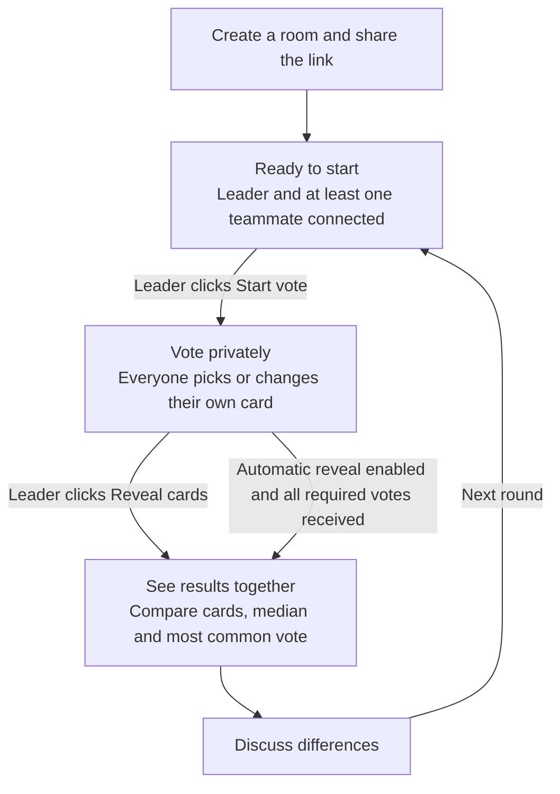

# Scrum Poker — Intent Driven Development

Date: 2026-09-21

Status: Updated implementation baseline. Regression tests cover the resolved gaps below; visual browser behavior requires browser verification.

## 1. Product intent

Help a team estimate work together without participants being influenced by each other's numeric estimates before reveal. A facilitator should create a room, share one link, run a vote, discuss the revealed results, and start another vote with minimal setup.

Success means the team can complete this cycle easily, each participant controls their own estimate, and the leader controls when estimates become visible. The application must remain lightweight, easy to run, and easy to modify.

This document expresses intended outcomes and constraints. It does not introduce new product requirements or claim the current implementation satisfies every intent. [instructions.md](instructions.md) remains the agent-facing specification; differences requiring decisions are recorded below.

## 2. Actors and outcomes

| Actor | Intent | Observable outcome |
| --- | --- | --- |
| Leader | Bring the team into one session quickly. | Enter a name, create a room, and share a URL containing the room ID. |
| Participant | Join without account setup. | Open the URL, enter a name, and appear in the room. |
| Participant | Estimate independently. | Select or revise a card while voting; see the saved choice without exposing its numeric value to others. |
| Leader | Control when discussion begins. | Start voting and reveal estimates; other participants cannot perform those actions. |
| Leader | Reveal promptly when the room is ready. | Optionally enable automatic reveal; the server reveals after every current participant submits an estimate or abstention. |
| Team | Understand the estimates. | See revealed cards, median, and most common vote. |
| Leader | Continue with little friction. | Select `Start vote` again to clear previous votes and begin another cycle. |
| Leader | Manage the room. | Remove non-leaders or end the session and return to the landing screen. |
| Maintainer | Run and evolve a small service. | Start one Docker service serving the frontend and backend on a defined port. |

## 3. Intent traceability

| ID | Requirement | Implementation location |
| --- | --- | --- |
| R1 | Create a room with a name; its creator becomes leader and receives a shareable room URL. | `create_room`, frontend `createRoom` |
| R2 | Join by room URL and name; detect missing or expired rooms before allowing a join. | `join_room`, `checkJoinRoomAvailability` |
| R3 | Only the leader starts voting and reveals cards. | `require_leader`, start/reveal routes |
| R4 | Hide other participants' estimates until reveal; allow the participant to see their own selection. | `serialize_room`, `get_viewer`, `renderParticipants` |
| R5 | Show revealed estimates, median, and most common vote; do not show an average. | `compute_stats`, `renderStats` |
| R6 | Repeat voting using `Start vote`, with no dedicated Restart button. | `start_vote`, `renderLeaderControls` |
| R7 | Let the leader remove non-leaders and end the session. | kick/end routes |
| R8 | Push room changes in real time. | Flask-Sock, `broadcast_room`, `connectRoomSocket` |
| R9 | Expire inactive rooms and cap active rooms at 10,000 by default. | TTL cleanup, `active_room_count` |
| R10 | Serve frontend and backend together in Docker, including deployment under `/poker` behind a reverse proxy. | Flask routes, base-path handling, Compose |
| R11 | Support persistent light/dark theme preference, a rooms-created counter, reveal animation, and confetti. | template and frontend rendering |

## 4. Behavioral contract

### Join and participate

A creator becomes the room leader. Visitors join through the shared URL using a name. Missing or expired room URLs show `Room not found` and disable joining before submission. Account registration is outside the intended scope.

### Vote independently, then reveal

Only the leader starts a vote or reveals cards. During voting, participants, including the leader, may submit or replace their own estimate. Each participant sees their selected card; other participants may see voting status but must not receive the numeric estimate through the UI or backend interfaces before reveal.

Starting a vote requires at least two connected participants, including the leader, enforced in both the UI and backend. While alone, the leader sees “Waiting for another participant”. Disconnecting during an active round does not cancel that round.

Reveal displays submitted estimates and aggregate statistics. Missing votes do not become zeroes. Selecting an estimate turns over only the current participant's card, beside their own name; other participants continue to see its back until reveal. Starting another vote clears the previous selections and results. Use `Start vote` for that action; do not add an average or a dedicated Restart button unless requirements change.

Each round follows the same loop. Starting the next round clears the previous votes and increments the round number; the first round is 1. While waiting to start again, the previous results remain visible.

Automatic reveal waits for votes from connected participants and the leader. A departed non-leader without a vote does not block it; an abstention counts as a response.

At any stage, the leader can end the room, or the room can expire through inactivity.

### Understand the result

Median and most common vote are required. Current code provides these concrete rules as the existing behavior baseline:

| Numeric votes | Median | Most common vote |
| --- | --- | --- |
| `3, 5, 8` | `5` | None |
| `3, 3, 5, 5` | `4` | `3` (smallest value in a repeated-frequency tie) |
| `8, 8, 8` | `8` | `8` |
| None | Statistics hidden | Statistics hidden |

`Need context` (abstention) is excluded from numeric statistics and its status is visible before reveal. The create-room form asks only for a name and uses Fibonacci (`1, 2, 3, 5, 8, 13, 21`). Only exact finite numeric card values or `abstain` are accepted.

### Keep the session understandable

- Push room updates in real time without manual refresh.
- Label the current participant inline as `Name (You)`.
- Show a Left badge to everyone after a participant's last socket disconnects; keep their card and submitted vote through the current round. Reconnecting clears the badge. Starting the next round removes offline non-leaders. Departed non-leaders without votes do not block automatic reveal; the leader's vote is still required.
- Preserve the light/dark theme preference between visits.
- Show total rooms created on the landing screen, persisted in a separate SQLite file and reloaded across restarts. Persist only the counter, not rooms, participants, or votes. Compose uses a named volume for this file.
- Present cards with portrait proportions, a single centered estimate and patterned burgundy backs. Higher estimates make only the estimate numeral grow and glow; dark mode uses subdued dark faces and backs. Reveal with a 3D flip, respecting reduced-motion preferences; keep the viewer’s own selection visible before reveal. Confetti requires at least two participants, all with identical numeric votes and no abstentions or missing votes.
- Let the leader remove non-leaders and end the room. Ended or expired rooms no longer accept participation.

## 5. Constraints and non-goals

| Constraint | Intended effect |
| --- | --- |
| Plain JavaScript, HTML, CSS; buildless frontend | Keep changes and startup simple. |
| Simple Python backend; existing Flask + Flask-Sock model | Extend existing HTTP and WebSocket behavior with minimal complexity. |
| In-memory SQLite | Keep storage lightweight; data lasts only for the process lifetime. |
| Backend serves the frontend | Deploy one application service. |
| Docker and a defined port | Keep runtime packaging reproducible. |
| Support `/poker` and Nginx proxying | Preserve deployment compatibility for pages, assets, APIs, and WebSockets. Version static asset URLs when the UI changes so browsers do not combine stale JavaScript or CSS with a newly deployed counterpart. |
| Simple inactivity TTL cleanup | Bound retention without complex schedulers. |
| Default maximum of 10,000 active rooms | Bound active room creation. |

No account system, durable room persistence, advanced permissions, admin dashboard, or heavy frontend toolchain is required. Process restart loses room data by design; only the aggregate counter survives. The existing process-local database and socket registry require a single application process; independent replicas would not share state.

Current application defaults are `PORT=8000`, `ROOM_TTL_SECONDS=86400`, `MAX_ACTIVE_ROOMS=10000`, and empty `BASE_PATH`. Compose sets `/poker`. Cleanup is lazy; an idle open socket does not itself refresh room activity.

## 6. Development and verification approach

For each change:

1. Identify the actor's intended outcome and its requirement ID in section 3.
2. Describe observable success, including relevant failure behavior, before choosing an implementation.
3. Inspect the existing flow and make the smallest change that fulfills the outcome within section 5's constraints.
4. Verify the affected acceptance criteria in section 7. Exercise outcomes rather than merely mirroring implementation details.
5. Record evidence and remaining gaps. Update `instructions.md` when behavior changes and keep this document aligned with approved intent.

Example acceptance scenario:

> **Intent:** A participant can change their mind without influencing others.
>
> **Given:** Voting is open and the participant previously chose 3.
>
> **When:** They choose 5.
>
> **Then:** Their selected card becomes 5; others cannot obtain that numeric value before reveal; after reveal, their card shows 5 and statistics count it once.

Public participant IDs are separate from private room-session cookies. Create/join issues a random credential in an HttpOnly, SameSite=Strict cookie, Secure over HTTPS, and stores only its hash. Private HTTP reads/actions and WebSocket connections verify the cookie against the supplied participant ID. Credentials are never included in shared snapshots or WebSocket URLs. Account registration remains out of scope.

Shared room operations are serialized with a reentrant lock. Socket receive loops do not hold the lock. The application remains a single-process service. Regression tests cover concurrency and permissions; `/health` checks the in-memory database and persistent counter, and Docker probes it automatically.

## 7. Acceptance criteria

Python application code lives in `src/`. Backend regression coverage is in `tests/test_room_lifecycle.py`, `tests/test_auto_reveal.py`, and `tests/test_counter.py`. For visual and multi-browser verification, use separate browser profiles so local storage and session cookies remain independent.

| Check | Expected result |
| --- | --- |
| Create and share | Named creator becomes leader; another browser joins the shared URL. |
| Invalid room | Missing/expired URL displays `Room not found` and disables joining before submission. |
| Leader permissions | Ordinary participant cannot start, reveal, kick, or end, including by submitting a public leader ID with a different or missing session cookie. |
| Hidden votes | During voting, shared snapshots contain no numeric estimates; each authenticated viewer can access only their own selection. |
| Vote replacement | Selecting another card replaces the participant's current vote. |
| Reveal statistics | Verify odd/even medians, tied modes, unique votes, abstentions, and no numeric votes. No average appears. |
| Next vote | `Start vote` clears prior votes and statistics and restores independent voting. No Restart button appears. |
| Presence and removal | Socket changes update presence; kicking removes the participant and vote; ending deletes the room. |
| Real-time updates | Two browsers receive join, vote-status, reveal, and new-vote changes without reloading. |
| Retention and capacity | With small test settings, expired rooms disappear on cleanup and excess creation returns 503. |
| Deployment | Page, assets, REST actions, and socket updates work at root and under `/poker`, including through Nginx. |
| Presentation | Theme survives reload, current user has `(You)`, the counter survives process replacement, and reveal animation runs. |

## 8. Current gaps and decisions
